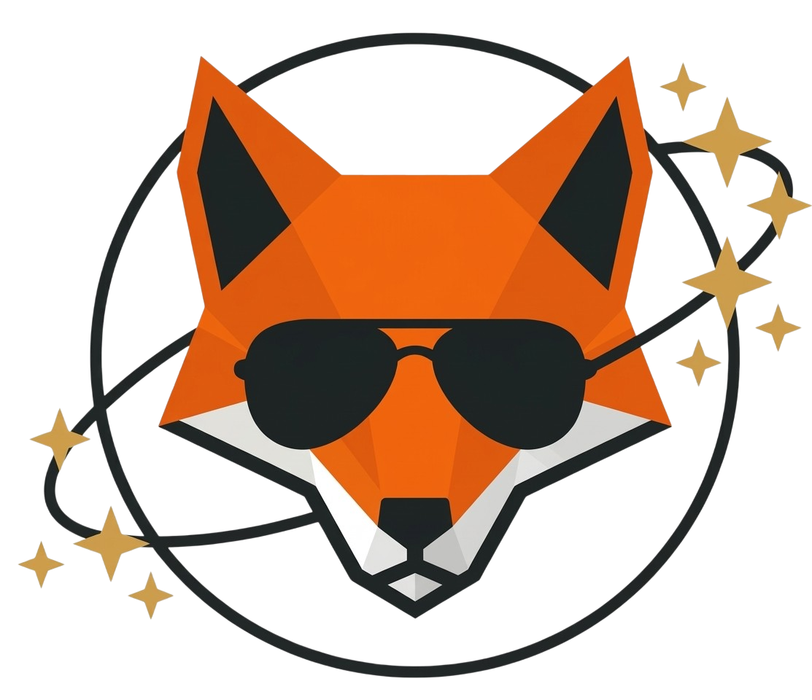
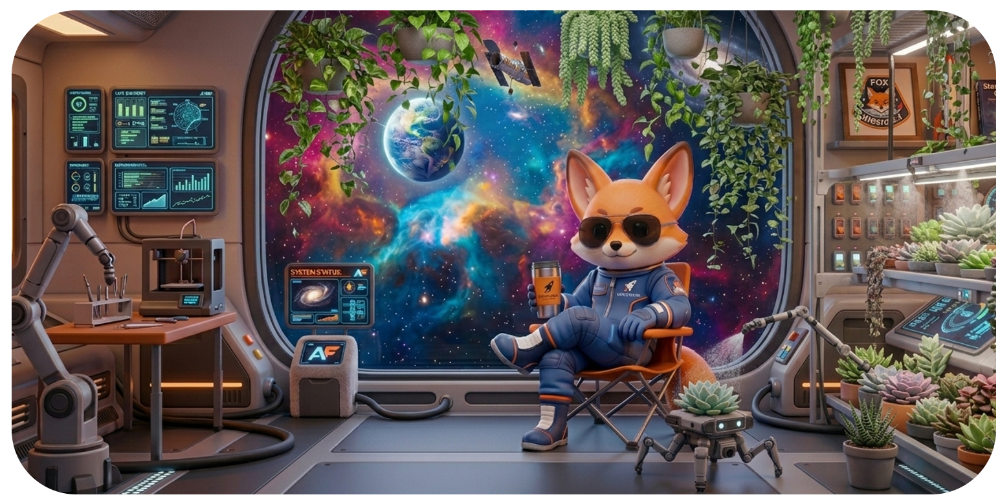

  
<strong>DESIGN & DEVELOPMENT BY</strong>

  <picture>
    <source media="(prefers-color-scheme: dark)" srcset="./assets/logofoxligth.png">
    <source media="(prefers-color-scheme: light)" srcset="./assets/logofox.png">
    
  </picture>

 

<h2 align="center">🦊 Miguel Angel — Frontend & UX Developer</h2>

  Building thoughtful digital experiences, 
  with intention, clarity and a human approach.

  <strong>
    Soluciones inteligentes, diseñadas con intención, 
    trabajando juntos, con calma y propósito, creando algo mejor.
  </strong>

---

### 🧠 Sobre mí / About me

Soy desarrollador enfocado en crear **productos digitales claros, funcionales y bien pensados**.  
Trabajo en la intersección entre **UX, desarrollo frontend y lógica de producto**, donde cada decisión tiene un propósito.

Me especializo en:

- Landing pages modernas y optimizadas  
- Aplicaciones web interactivas  
- Dashboards y visualización de datos  
- Interfaces rápidas, escalables y centradas en el usuario  

También cuento con experiencia en backend trabajando con **Node.js y bases de datos MySQL**, desarrollando lógica de negocio, consumo de APIs y estructuras de datos eficientes.

Me siento cómodo trabajando tanto en frontend como en backend, lo que me permite tener una visión completa del producto y tomar mejores decisiones técnicas.

Mi enfoque no es solo construir interfaces, sino **resolver problemas reales con diseño y tecnología**.

<!-- ---  

### 🚀 Mentalidad de trabajo  

- 🧠 Pienso antes de construir  
- 🎯 Diseño con intención  
- ⚡ Optimizo para rendimiento  
- 🤝 Construyo experiencias útiles, no solo visuales  
- 💬 Comunicación constante con el cliente  
- 🤝 Trabajo colaborativo durante todo el proceso  
- 🔍 Transparencia en decisiones, avances y resultados  

--- -->

### 📫 Contacto

📩 [migueljc1994@gmail.com](mailto:migueljc1994@gmail.com)

---

### 🌎 Estoy abierto a / I’m open to

- Nuevas oportunidades / New opportunities  
- Proyectos freelance / Freelance projects  
- Colaboraciones y proyectos en conjunto / Collaborations & team projects  
- Desarrollo de landing pages / Landing page development  
- Aprender y trabajar con nuevas tecnologías / Learning and working with new technologies  

 

  

